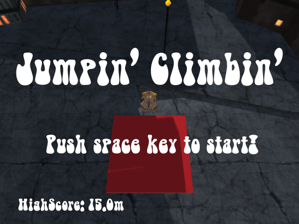

# Jumpin' Climbin'

Unityの学習及びインターンの課題用に作成したゲームです．

推奨のゲーム画面サイズは650×400です．

##概要
空中に浮遊するジャンプ台を利用してひたすら上に登っていくゲームです．

Unityちゃんを動かして，ジャンプ台に乗るとジャンプします．
ジャンプ台に乗り損ねるとゲームオーバーです．

##操作方法
- 矢印キー：移動
- スペースキー：ゲームの開始
- Qキー：画面のキャプチャ（Imagesフォルダ以下に保存されます）

##ジャンプ台
####白
最も普遍的なジャンプ台。特徴は特に無し．
####赤
一番最初に登場する初心者用のジャンプ台。白よりも少し大きくて，ジャンプ力が高い．
####青
50mを過ぎると稀に登場．サイズは小さいが圧倒的なジャンプ力を誇る．

##スクリーンショット
タイトル画面

青いジャンプ台

ゲームオーバー時

##ライセンス
####効果音・BGM関連
BGM：フリー音楽素材 Senses Circuit http://www.senses-circuit.com/

フリーBGM・音楽素材MusMus http://musmus.main.jp/

この作品は<a href="http://unity-chan.com/contents/license_jp/" target="_blank">ユニティちゃんライセンス条項</a>の元に提供されています

